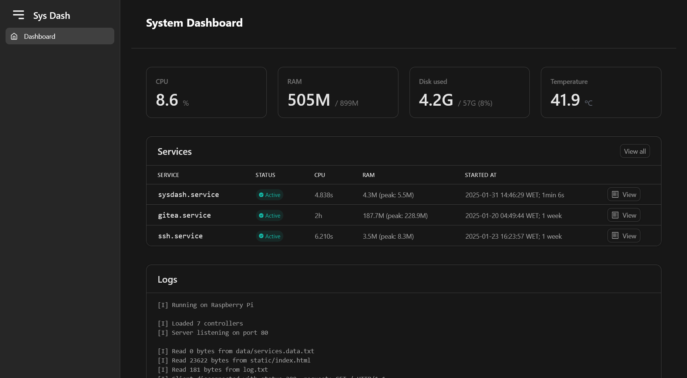

# System Dashboard

A system dashboard that monitors system resources and provides system information.



Made with my own use case in mind, all made from scratch, from the server to the html parser.

## Features

On the web interface:
- Display CPU usage
- Display RAM usage
- Display Disk usage
- Display system temperature
- View and manage services (logs, start/restart, stop)
- View program logs

On the server:
- Choose the port
- View program logs

## Getting Started

### Prerequisites

- GCC compiler
- Make
- Gengetopt

### Building the Project

To build the project on linux, run the following command:

```sh
make raspberrypi
```

To build on WSL, just run:

```sh
make
```
(the reason for this is because WSL doesn't support systemctl so sample data is used when using `make` only) 

### Running the Project

To run the project, execute the following command:

```sh
./sysDash
```

### Configuration

You can configure the server port by using the `--port` option:

```sh
./sysDash --port 8080
```

## License

This project is licensed under the GNU General Public License v3.0. See the [LICENSE](LICENSE) file for details.
